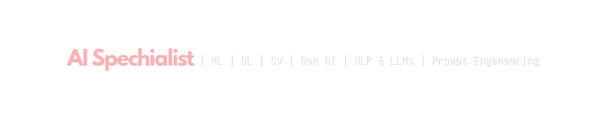
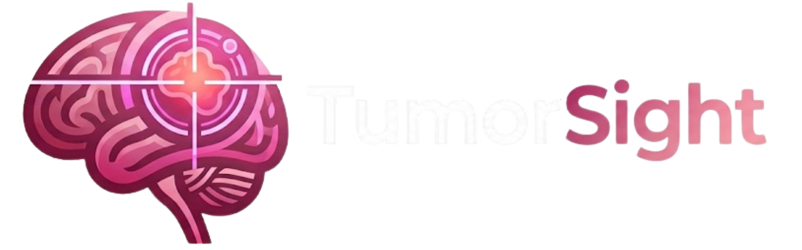
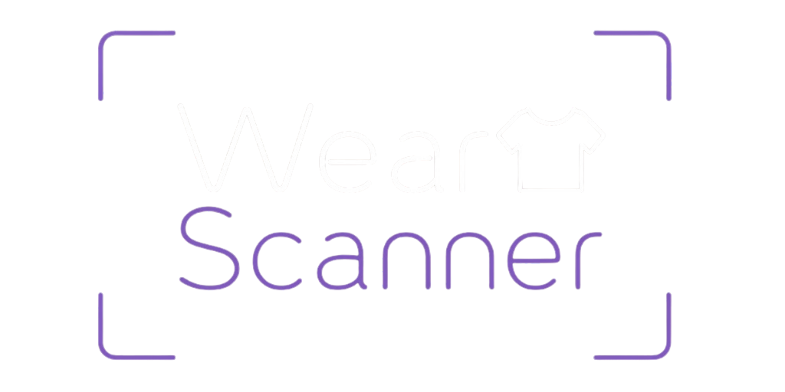

  <!-- 1. VIBRANT NARROW HEADER BANNER -->
  

  <!-- 2. ANIMATED GREETING SVG -->
  

    
  

  <!-- 3. SPECIALIZATIONS BANNER -->
  

  

    An Artificial Intelligence Specialist dedicated to developing intelligent technologies that bridge data, innovation, and practical solutions. Skilled in Machine Learning, Deep Learning, Computer Vision, Generative AI, Data Analytics, and AI Solution Development.
  

  

    <em>· · ────── ꒰ Curious by nature, driven by innovation, and always exploring what's next in AI ꒱ ────── · ·</em>
  

 

 

  

### Programming Languages

### AI, Machine Learning & Computer Vision

### Data Science & Analytics

### Cloud & Deployment
    

### Development Tools & Platforms
                  

 

 

  

  

<h3 align="center">Smart Vision System for Safer Childhood Environments</h3>

  AI-powered child safety monitoring system using YOLOv8s ONNX models to detect falls and physical violence, send real-time alerts, and generate incident reports and analytics for caregivers.

  <code>Python</code> &bull; <code>FastAPI</code> &bull; <code>React</code> &bull; <code>Tailwind CSS</code> &bull; <code>PostgreSQL</code> &bull; <code>YOLOv8</code> &bull; <code>ONNX Runtime</code> &bull; <code>OpenCV</code> &bull; <code>Roboflow</code> &bull; <code>WebSockets</code>

  

 

  

<h3 align="center">Brain Tumor MRI Classification System</h3>

A privacy-focused, responsive AI system for brain MRI classification, combining a fine-tuned VGG16 model with 97% recall, confidence-driven insights, and an interactive 3D brain experience.

<code>Python</code> • <code>TensorFlow</code> • <code>VGG16</code> • <code>FastAPI</code> • <code>React</code> • <code>Vite</code> • <code>Tailwind CSS</code> • <code>Azure</code> • <code>Docker</code>

  

 

  

<h3 align="center">Fashion Item Classifier & Styler</h3>

  CNN-based fashion image classifier trained on Fashion-MNIST that predicts clothing categories and generates styling recommendations, occasion suggestions, and accessory ideas.

  <code>Python</code> &bull; <code>TensorFlow</code> &bull; <code>CNN</code> &bull; <code>Deep Learning</code>

  

 

    These are a few of my featured projects. Explore my GitHub for more AI projects and technical work!

  

 

 

  
   
  Open to collaborations, AI opportunities, and building intelligent solutions. ✩‧₊

 

&nbsp;&nbsp;&nbsp;

  
    Designed & built with ❤️ by <b>Renad Alharthi</b> 
  

